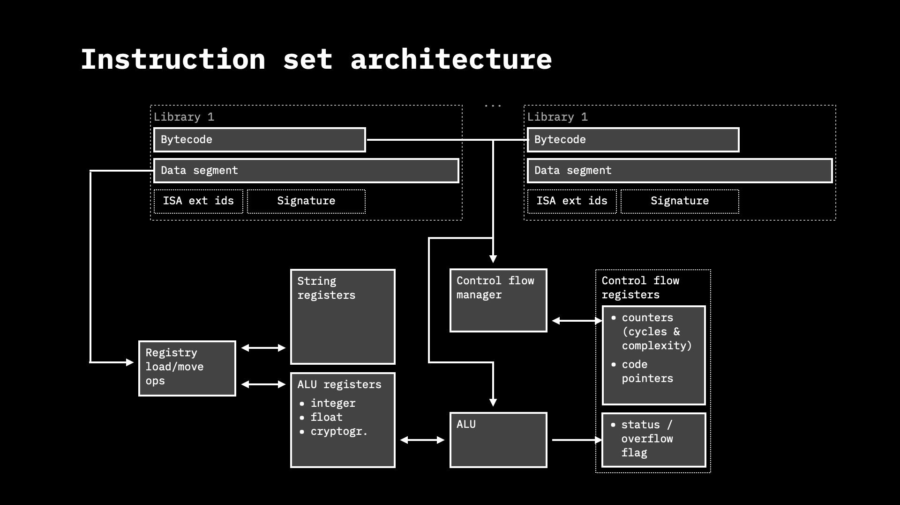

# AluVM rust implementation

Rust implementation of AluVM (arithmetic logic unit virtual machine) and 
assembler from Alu Assembly language into bytecode. 

AluVM is a pure functional register-based highly deterministic & 
exception-less instruction set architecture (ISA) and virtual 
machine (VM) without random memory access, capable of performing arithmetic 
operations, including operations on elliptic curves. The AluVM ISA can be 
extended by the environment running the virtual machine (host environment), 
providing ability to load data to the VM registers and support 
application-specific instructions (like SIMD).

The main purpose for ALuVM is to be used in distributed systems whether 
robustness, platform-independent determinism are more important than the 
speed of computation. The main area of AluVM applications (using appropriate 
ISA extensions) is blockchain environments, consensus-critical computations, 
edge computing, multiparty computing (including deterministic machine learning),
client-side-validation, sandboxed Internet2 computing and genetic algorithms.

For more details on AluVM, please check [the specification][AluVM], watch
detailed presentation on [YouTube] or [check slides] from the presentation.

## Design

The robustness lies at the very core of AluVM. It is designed to avoid any
undefined behaviour. Specifically,
* All registers may be in the undefined state;
* Impossible/incorrect operations put destination register into a special 
  *undefined state*;
* Code always extended to 2^16 bytes with zeros, which corresponds to 
  “set st0 register to false and stop execution” op-code;
* There are no invalid jump operations;
* There are no invalid instructions;
* Cycles & jumps are counted with 2^16 limit (bounded-time execution);
* No ambiguity: any two distinct byte strings always represent strictly 
  distinct programs;
* Code is always signed;
* Data segment is always signed;
* Code commits to the used ISA extensions;
* Libraries identified by the signature;
* Code does not run if not all libraries are present;

## Instruction Set Architecture

### Instruction opcodes

- RISC: only 256 instructions
- 3 families of core instructions:
  * Control flow
  * Data load / movement between registers
  * ALU (including cryptography)
- Extensible with ISA extensions: 127 of the operations are reserved for 
  extensions
  * More cryptography
  * Custom data I/O (blockchain, LN, client-side-validation)
  * Genetic algorithms / code self-modification
  
The arithmetic ISA is designed with strong robustness goals:
- Impossible arithmetic operation (0/0, Inf/inf) always sets the destination 
  register into undefined state (unlike NaN in IEEE-754 it has only a single 
  unique value)
- Operation resulting in the value which can't fit the bit dimensions under a 
  used encoding, including representation of infinity for integer encodings 
  (x/0 if x != 0) results in:
  * for float underflows, subnormally encoded number, 
  * for x/0 if x != 0 on float numbers, ±Inf float value,
  * for overflows in integer checked operations and floats: undefined value, 
    setting st0 to false,
  * for overflows in integer wrapped operations, modulo division on the maximum
    register value

Most of the arithmetic operations has to be provided with flags specifying 
which of the encoding and exception handling should be used:
* Integer encodings has two flags:
  - one for signed/unsigned variant of the encoding 
  - one for checked or wrapped variant of exception handling
* Float encoding has 4 variants of rounding, matching IEEE-754 options

Thus, many arithmetic instructions have 8 variants, indicating the used 
encoding (unsigned, signed integer or float) and operation behavior in 
situation when resulting value does not fit into the register (overflow or 
 wrap for integers and one of four rounding options for floats).

Check [the specification][AluVM] for the details.

### Registers

**ALU registers:** 8 blocks of 32 registers
- Integer arithmetic (A-registers) blocks: 8, 16, 32, 64, 128, 256, 512, 
  1024 bits
- Float arithmetic (F-registers) blocks:
  * IEEE: binary-half, single, double, quad, oct precision 
  * IEEE extension: 80-bit X87 register
  * BFloat16 register, used in Machine learning
- Cryptographic operations (R-registers) blocks: 128, 160, 256, 512, 1024, 
  2048, 4096, 8192 bits
- String registers (S-registers): 1 block of 256 registers, 64kb each

**Control flow registers:**
- Status (st0), boolean (one bit)
- Cycle counter (cy0), 16 bits
- Instruction complexity accumulator (ca0), 16 bits
- Call stack register (cs0), 3*2^16 bits (192kB block)
- Call stack pointer register (cp0), 16 bits

## History

- The need for AluVM recognized as a part of RGB project on the
  Mar, the 24 & 31st, 2021 (see developers call <https://youtu.be/JmKNyOMv68I>)
- Concept was presented on 19th of May 2021 
  ([check the recoding](https://youtu.be/Mma0oyiVbSE))
- v0.1 release of Rust AluVM implementation on the 28th of May 2021
  ([ISA & API docs](https://docs.rs/aluvm/0.1.0/alure/))
- v0.2 release with multiple enhancements on the 9 Jun 2021
  ([ISA & API docs](https://docs.rs/aluvm/0.2.1/aluvm/)) – see presentation
  on [Youtube] or read [slides]

[AluVM]: https://github.com/internet2-org/aluvm-spec
[YouTube]: https://www.youtube.com/watch?v=brfWta7XXFQ
[slides]: https://github.com/LNP-BP/presentations/blob/master/Presentation%20slides/Single-use-seals.pdf